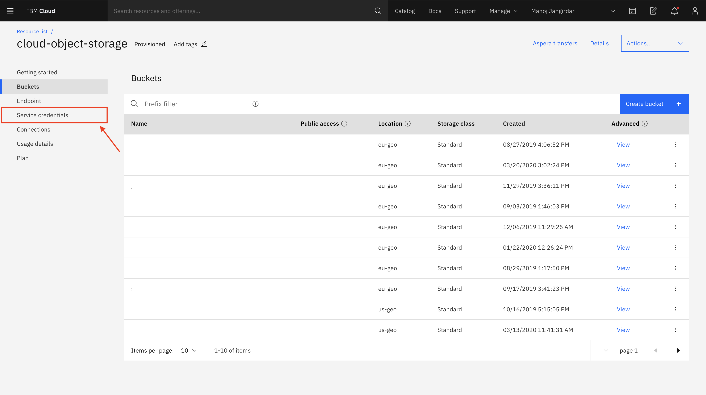
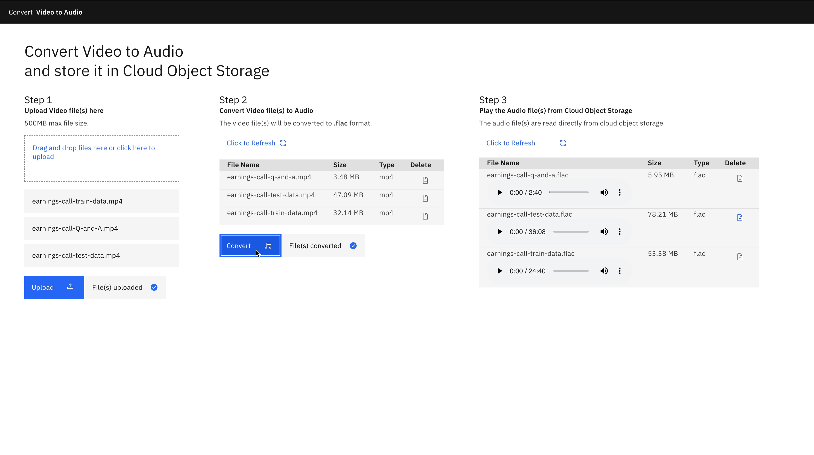

**Work in progress**
# Extract Audio from Video and store it in Cloud Object Storage

This Code Pattern is part of the series [Extracting Textual Insights from Videos with IBM Watson]()

Part of the World Health Organization's guidance on limiting further spread of COVID-19 is to practice social distancing. As a result, Companies in most affected areas are taking precautionary measures by encouraging Work from Home and Educational Institutes are closing their facilities. Employees working from home must be aware of the happenings in their company and need to collaborate with their team, students at home must be up to date with their education.

With the help of Technology, employees can continue to collaborate and be involved into their work with Virtual Meetings, Schools and teachers can continue to engage with their students through Virtual Classrooms.

In this code pattern, we will extract audio from video and store it in Cloud Object Storage.

Given a video recording of the virtual meeting or a virtual classroom, textual insights are extracted from them to better understand the key pointer and summary of the meeting or lecture.

The basic idea is to extract textual insights from a video recording using watson services. Watson Natural Language Understanding and Watson Tone Analyzer can generate insights from Text, Watson Speech To Text can generate the text given an audio file. We have a video file as our source hence the first step is to convert the video to audio for further analysis.

When you have completed this code pattern, you will understand how to:

* Connect applications directly to Cloud Object Storage.
* Use other IBM Cloud Services and open-source tools with your data.

<!--add an image in this path-->


<!--Optionally, add flow steps based on the architecture diagram-->
## Flow

1. User uploads video file to the application.

2. The [FFMPEG](https://www.ffmpeg.org/) library extracts the audio from the video.

3. The extracted audio file is stored in Cloud Object Storage.

<!--Optionally, update this section when the video is created-->
# Watch the Video

Coming Soon!

<!-- [](https://www.youtube.com/watch?v=Jxi7U7VOMYg) -->

# Pre-requisites

1. [IBM Cloud](https://cloud.ibm.com) Account.

2. [Docker](https://www.docker.com/products/docker-desktop).


# Steps

1. [Clone the repo](#1-clone-the-repo).

2. [Create Cloud Object Storage Service](#2-create-cloud-object-storage-service).

3. [Add the Credentials to the Application](#3-add-the-credentials-to-the-application).

4. [Deploy the Application](#4-deploy-the-application).

5. [Run the Application](#5-run-the-application).


### 1. Clone the repo

Clone the [`convert-video-to-audio`](https://github.com/IBM/convert-video-to-audio) repo locally. In a terminal, run:

```bash
$ git clone https://github.com/IBM/convert-video-to-audio
```

### 2. Create Cloud Object Storage Service

>NOTE: Create the Cloud Object Storage Service if not already created.


- Create a [Cloud Object Storage Service](https://cloud.ibm.com/catalog/services/cloud-object-storage) on IBM Cloud.

- In Cloud Object Storage Resource Page, Click on **Services Credentials**



- Click on **New credential** and add a service credential as shown. Once the credential is created, copy and save the credentials in a text file for using it in later steps in this code pattern.


### 3. Add the Credentials to the Application

- In the repo parent folder, open the **credentials.json** file and paste the credentials copied in [step 2](#2-create-cloud-object-storage-service) and finally save the file.

### 4. Run the Application

<details><summary><b>With Docker Installed</b></summary>

- Build the **Dockerfile** as follows :

```bash
$ docker image build -t convert-video-to-audio .
```

- once the dockerfile is built run the docker file as follows :

```bash
$ docker run -p 8080:8080 convert-video-to-audio
```

- The Application will be available on <http://localhost:8080>

</details>

<details><summary><b>Without Docker </b></summary>

- Install the **FFMPEG** library.

For Mac users run the following command:

```bash
$ brew install ffmpeg
```

Other platform users can refer to the [ffmpeg documentation](https://www.ffmpeg.org/download.html) to install the library.

- Install the python libraries as follows:

    - change directory to repo parent folder
    
    ```bash
    $ cd convert-video-to-audio/
    ```

    - use `python pip` to install the libraries

    ```bash
    $ pip install -r requirements.txt
    ```

- Finally run the application as follows:

```bash
$ python app.py
```

- The Application will be available on <http://localhost:8080>

</details>

### 5. Run the Application

Visit  <http://localhost:8080> on your browser to run the application.



Now you can extract the audio and store it in Cloud Object Storage in just 3 steps:

1. Upload the Videos file `earnings-call-train-data.mp4`, `earnings-call-test-data.mp4` & `earnings-call-Q-and-A.mp4` from the `data` directory of the cloned repo and click on `Upload` button.

2. Click on `Extract Audio` button to extract the audio.

3. Download the `earnings-call-test-data.flac` & `earnings-call-Q-and-A.flac` as shown, it will be used in the [second code pattern](https://github.com/IBM/build-custom-stt-model-with-diarization) from the series.


More About the dataset:
For the code pattern demonstration, we have considered `IBM Earnings Call Q1 2019` Webex recording. The data has 40min of IBM Revenue discussion, and 20+ min of Q & A at the end of the recording. We have split the data into 3 parts:

- `earnings-call-train-data.mp4` - (Duration - 24:40)
This is the initial part of the discussion from the recording which we will be using to train the custom Watson Speech To Text model in the second code pattern from the series.

- `earnings-call-test-data.mp4` - (Duration - 36:08)
This is the full discussion from the recording which will be used to test the custom Speech To Text model and also to get transcript for further analysis in the third code patten from the series.

- `earnings-call-Q-and-A.mp4` - (Duration - 2:40)
This is a part of Q & A's asked at the end of the meeting. The purpose of this data is to demonstrate how Watson Speech To Text can detect different speakers from an audio which will be demonstrated in the second code pattern from the series.

<!-- keep this -->
## License

This code pattern is licensed under the Apache License, Version 2. Separate third-party code objects invoked within this code pattern are licensed by their respective providers pursuant to their own separate licenses. Contributions are subject to the [Developer Certificate of Origin, Version 1.1](https://developercertificate.org/) and the [Apache License, Version 2](https://www.apache.org/licenses/LICENSE-2.0.txt).

[Apache License FAQ](https://www.apache.org/foundation/license-faq.html#WhatDoesItMEAN)
