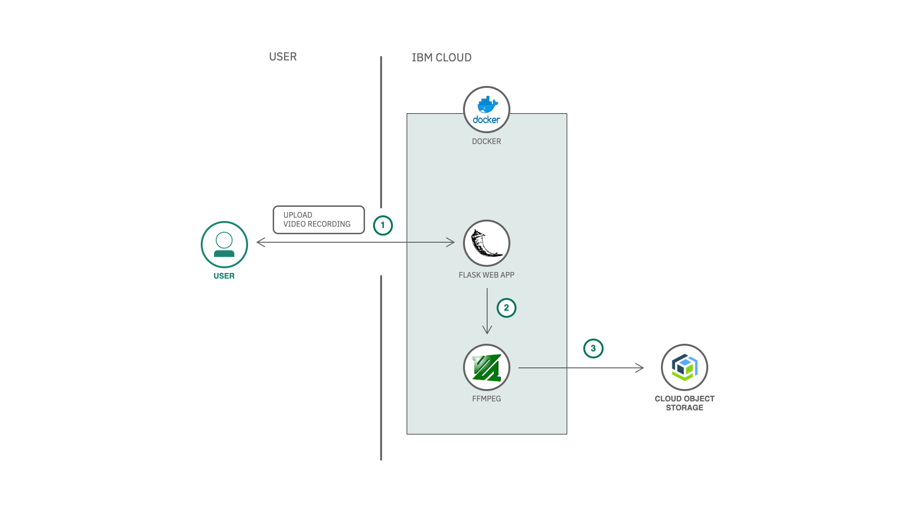

# Short Title

Extract audio from video

# Long Title

Extract audio from video and store it in cloud object storage

# Author
* [Manoj Jahgirdar](https://www.linkedin.com/in/manoj-jahgirdar-6b5b33142/)
* [Manjula Hosurmath](https://www.linkedin.com/in/manjula-g-hosurmath-0b47031)

# URLs

### Github repo

* https://github.com/IBM/convert-video-to-audio/

### Video Link
* https://youtu.be/zbhDULZGJEE

# Summary

In this code pattern, Given a video recording of the virtual meeting or a virtual classroom, we extract the audio from the video and store it in IBM Cloud Object Storage.

# Technologies

* [Python](https://developer.ibm.com/technologies/python): An open-source interpreted high-level programming language for general-purpose programming.

* [Object Storage](https://developer.ibm.com/technologies/object-storage): Store large amounts of data in a highly scalable manner.

# Description

Part of the World Health Organization's guidance on limiting further spread of COVID-19 is to practice social distancing. As a result, Companies in most affected areas are taking precautionary measures by encouraging Work from Home and Educational Institutes are closing their facilities. Employees working from home must be aware of the happenings in their company and need to collaborate with their team, students at home must be up to date with their education.

With the help of Technology, employees can continue to collaborate and be involved into their work with Virtual Meetings, Schools and teachers can continue to engage with their students through Virtual Classrooms. These meetings are recorded, deriving insights from these recordings can be beneficial for the end users. Towards this goal, we will be extracting audio from video recordings which will be used for deriving insights.

# Flow

<!--add an image in this path-->

1. User uploads video file to the application.

2. The [FFMPEG](https://www.ffmpeg.org/) library extracts the audio from the video.

3. The extracted audio file is stored in Cloud Object Storage.

# Instructions

> Find the detailed steps in the [README](https://github.com/IBM/convert-video-to-audio/blob/master/README.md) file.

1. Clone the repo

2. Create Cloud Object Storage Service

3. Add the Credentials to the Application

4. Deploy the Application

5. Run the Application

# Components and services

* [Object Storage](https://cloud.ibm.com/catalog/services/cloud-object-storage): IBM Cloud Object Storage is a highly scalable cloud storage service, designed for high durability, resiliency and security. Store, manage and access your data via our self-service portal and RESTful APIs. Connect applications directly to Cloud Object Storage use other IBM Cloud Services with your data.
